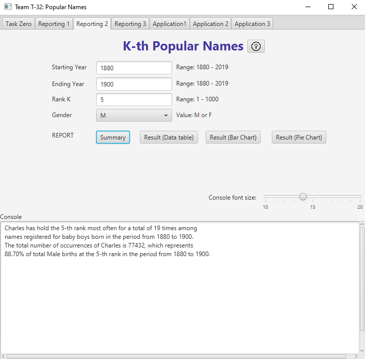

# Comp3111 Project Team T32 - PopNames:)

https://github.com/bonzili/Comp3111

## 1. Li Ho Yin Bonzi
Email: hyliat | Github: bonzili | Dev branch: bonzi_dev

Task 2 & Task 5

## 2. Liu zi jie
Email: zliubz | Github: zliubz | Dev branch: zliubz-patch-1

Task 1 & Task 4

## Screenshots for Task 2:
Summary | Error Handling | Custom Console Text size |
:-------------------------:|:-------------------------:|:-------------------------:
 |   | 

Result (Data Table) | Result (Bar Chart) | Result (Pie Chart) |
:-------------------------:|:-------------------------:|:-------------------------:
 |   | 

## Screenshots for Task 5:
Algorithm T5X1 | Algorithm T5X1 without initial input| Algorithm T5X1 with initial input |
:-------------------------:|:-------------------------:|:-------------------------:
 |   | 

Help Message for Task 5 | Help Message for Algorithm T5X1 | Help Message for Algorithm T5X2 |
:-------------------------:|:-------------------------:|:-------------------------:
 |   | 

## Documentation: (Please download the entire folder and open the index.html in your local machine)
[Unit Testing Report](Documentation/test)

[Coverage Test Report](Documentation/jacocoHTML)

[JavaDoc Documentation](Documentation/javadoc)

## Supplementary Notes:

### Special Feature of the System developed by Li Ho Yin:
- Customizable: A slider that allows the users to control the console text size. [Example](./screenshots/T2_LargerConsoleText.png)
- Output: Users are able to print the charts and graphs or export them to .pdf format simply by clicking on the button below the chart. [Example](./screenshots/T2_BarChart.png)
- Output: Users can click on the corresponding part in the charts or graphs and the exact value will be displayed. [Example](./screenshots/T2_PrintPDF.pdf)
- Error Handling: User will be notified which input field are invalid and tell them why it is invalid. [Example](./screenshots/T2_ErrorHandling.png)
- Input Tolerance: User are free to use a mix of uppercase and lowercase characters in their name field. The system will help the user to convert their input from mixed case to a system format e.g. from pEtER to Peter. [Example](./screenshots/T5_MixCases.jpg)
- Help Message: Help messages are provided for Task 2 and Task 5. Users can click the ? button to display the help message. [Example](./screenshots/T5_HelpT5X2.png)

### Li Ho Yin's algorithm developed for the T5X2 and justifications: 
In using the algorithm T5X2, user are allowed to leave their preferred name inital as blank. If they leave their preferred name initial as blank, the algorithm will compute the name of their potential soulmate which is equal to most popular name in their preferred gender with the same initial as the user's name initial which is younger or older than the user (from 1880 to their year of birth or from their year of birth to 2019). This is determined by their preferred age. In here, we are using the user's name inital as the potential soulmate initial because according to the name-letter effect discovered in 1985 by the Belgian psychologist Jozef Nuttin, people tends to prefer the letters in their name especially for their name initial over other letters in the alphabet as most people like themselves and the name is associated with the self. Hence the letters of the name are preferred. From the the [bar chart](./src/main/resources/name_initials_effect.png), groups with shared initials have higher group performance, collective efficacy and adaptive conflict ability. Therefore, it is believed that they have a higher chance to become soulmate since they share the same initials.
If the user enter their preferred name initial, the algorithm will compute the name of their potential soulmate which is equal to most popular name in their preferred gender with the their preferred initial. However, they will be still notified the pros of finding a soulmate with the same name initial.
